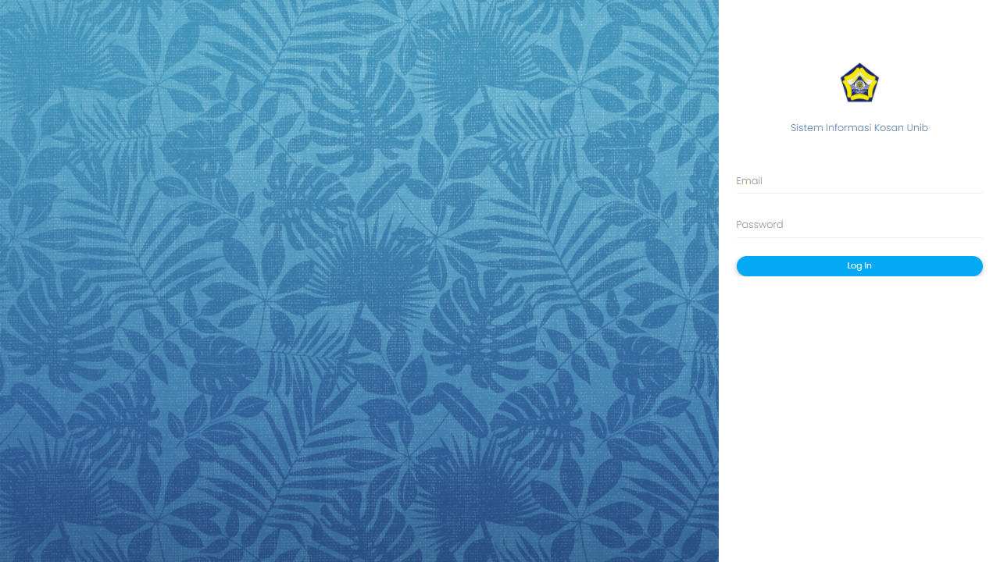

# Sistem Informasi Kosan UNIB
Sistem Informasi Manajemen Kosan, berfungsi untuk melakukan pengelolaan dan pencatatan terhadap hunian kos-kosan yang dimiliki oleh pengelola. Aplikasi ini dibangun dengan CodeIgniter 3.

```
adminsuper@admin.com
12345
```

## Hasil Implementasi

### Login


Pada bagian login, username dan password yang diinputkan pada form akan dicocokkan dengan daftar email dan password yang ada pad tb_admin, tb_pengelola, dan tb_penghuni secara berturut-turu. Ketika email dan password yang dimasukkan tadi cocok dengan salah satu data yang ada pada tabel, maka data status login pada tabel tersebut akan diubah menggunakan query update where dimana yang awalnya bernilai 0 menjadi 1.

### Penghuni
### Dashboard Penghuni


Pada bagian dashboard ini, kita dapat melihat jumlah teman kosan. Query yang kita gunakan disini adalah select count(*) from tb_penguni where penghuni_id_kosan = pengelola_id_kosan da penghuni_id != penghuni_id kita. Dengan query tersebut, kita akan mengetahui jumlah penghuni yang satu kosan dengan kita.

Selain itu, kita juga bisa melihat jumlah tagihan kita yang belum di bayar. Kita gunakan query select sum(total tagihan) dimana kondinya adalah status belum lunas pada tabel tagihan, dan id user yang ditagihkan sama dengan id kita.

### Info Kosan


Pada menu ini, kita bisa melihat nama kosan kita. Query yang digunakan adalah select * from tb_pengelola right join tb_kosan dengan kondisi penghubungnya adalah id kosan, dan kondisi prasyaratnya adalah id kosan pada tabel tadi sama dengan id kosan kita. Setelah dijalankan, maka sistem akan menggunakan data pada kolom nama_kosan untuk menampilkan nama kosan kita. 

Untuk menampilkan nama kamar kosan penghuni, kita lakukan left join antara tabel kamarkosan dan tabel penghuni dimana id kosan dan id kamar kosan keduanya sesuai. Sesudah digabungkan, kita cetak kolom nama kamar kosan yang menandakan nama dari kamar kosan yang kita huni saat ini.

Pada tiap kosan, terdapat pengelola. Sebelumnya, kita sudah melakukan join antara tabel pengelola dan tabel kosan. Dengan data yang dihasilkan pada tabel ini, kita tampilkan data nama pengelola dan identitas dirinya pada menu yang kita buat.

### Teman Kosan


Pada menu ini, kita bisa melihat teman yang satu kosan dengan kita. Query yang kita gunakan adalah select * from tb penghuni inner join tb_kamarkosan pada kondisi id kamar kosan dan Id kosan bersesuaikan, dan kondisi prasyarat id kosannya sama dengan id kosan kita saat ini. Setelah itu, data yang ada akan ditampilkan pada tabel yang tersedia.

### Tagihan Penghuni


Pada menu ini, kita bisa melihat daftar tagihan yang belum lunas. Query yang kita gunakan adalah select * from tb_tagihan where status = bl or status = mk dimana kondisinya adalah tagihan id penghuni = id penghuni (id kita). Data kemudian di order berdasarkan tanggal pembuatan tagihan secara descend. Data pun ditampilkan pada tabel yang ada.

Data yang statusnya belum lunas dapat kita edit dengan tujuan untuk mengupload foto bukti pembayaran. Untuk menampilkan data tagihan yang diberikan oleh admin, query yang digunakan adalah select * from tb_tagihan where tagihan_id = id tagihan yang diberikan saat kita menekan tombol edit tagihan. Pada menu ini kita bisa mengupload dokumen bukti pembayaran, dimana alat bantu yang kita gunakan disini adalah dropify.

Selain itu, kita juga bisa melihat riwayat pembayaran yang sudah lunas. Query yang kita gunakan adlaah select * from tb_tagihan where status = l dan tagihan id penghuni = id penghuni (id kita). Data tagihan kita yang sudah lunas pun akan ditampilkan pada layar).

### Pengaturan Profil Penghuni


Pada bagian ini, kita bisa mengupdate data penghuni dan mengubah password penghuni. Untuk mengupdate data penghuni, query yang kita gunakan adalah update tb_penghuni set (semua data yang ingin di update) where penghuni_id = id penghuni yang saat ini login. Selain update pada database, sistem juga mengupdate foto yang tersimpan pada folder uploads/student_image menggunakan query $_FILES yang setara dengan query $_POST.

Untuk mengubah password, pertama-tama kita cek dulu apakah password yang tertulis di kedua kolom tersebut sama. Jika sama, maka query yang kita gunakan untuk mengupdate password adalah update tb_penghuni set password = new password where penghuni id = id penghuni yang login saat ini. 

Untuk menampilkan data yang sudah disimpan sebelumnya pada kolom edit profile, query yang kita gunakan adalah select * from tb_penghuni where penghuni_id = id penghuni yang login.

### Pengelola
### Dashboard Pengelola


Untuk menampilkan jumlah kamar kosan yang dinaungi pengelola, query yang kita gunakan adalah select count(*) form tb_kamarkosan where kamarkosan_id_kosan = id kosan si pengelola. 

Untuk menampilkan jumlah penghuni kosan pengelola, query yang kita gunakan adalah select count(*)  from tb_penghuni where Id kosannya sama dengan id kosan yang dikelola oleh kita.

Untuk menampilkan tagihan yang belum dibayar, kita melakukan join antara tabel tagihan dan tabel penghuni. Query yang kita gunakan adalah select sum(total_tagihan) from tb tagihan where status = bl left join tb penguni on tagihan Id penghuni = penghuni id, group by id kosan, dan kondisi syaratnya adalah id kosannya sama dengan id kosan yang pengelola miliki saat ini.

Untuk menampilkan data penghuni baru, kita gunakan query select * from tb_penghuni order by penghuni_id desc limit 0,5. Kita hanya menampilkan 5 data terakhir dari penghuni di kosan kita saja. 

### Kelola Kosan


Untuk menampilkan data kosan, query nya adalah select * from tb kosan. Untuk menampilkan kapasitas total, query yang kita gunakan adalah select sum(kapasitas total) from tb kamarkosan where kamarkosan id kosan = id kosan yang ditampilkan. Untuk menampilkan jumlah, kita gunakan select count(*) from tb_kamarkosan where kamarkosan id kosan = id kosan yang ditampilkan saat ini.

Query yang kita gunakan saat mengedit kosan, yaitu update tb_kosan set (semua data yang mau di update) where id kosan = id kosan yang ditampilkan saat ini. Kita juga bisa melihat daftar tagihan penghuni saat ini dengan melakukan join antara tb tagihan dan tb penghuni pada id penghuni, kemudian cari dimana kondisi status = bl (belum lunas) dan id kosan penghuni = id kosan kita saat ini, dan di order berdasarkan tanggal pembuatan tagihannya.

### Kamar Kos Pengelola


Untuk menambah kamar kosan di kosan yang kita kelola, query yang kita gunakan adalah insert into tb_kamarkosan (kolom yang mau diisi) values (nilai isian). Tampak di sini kita memasukkan beberapa data untuk membuat sebuah kosan baru. Kemudian, untuk menampilkan data kamar kosan pengelola, query yang kita gunakan adalah select * from tb_kamarkosan where kamarkosan id kosan = id kosan dari si pengelola saat inii.

Untuk menampilkan siapa saja penghuni dari suatu kamar kosan, kita gunakan query select * from tb_penghuni where penghuni id kosan = kamarkosan id kosan dan penghuni id kamarkosan = id kamarkosan. Kita juga bisa mengupdate data sebuah kamar kosan menggunakan query update tb_kamarkosan set (values yang ingin diupdate) where id kamarkosan = id kamarkosan yang sedang di edit.

### Daftar Tagihan Penghuni di Tempat Pengelola


Untuk melihat daftar tagihan yang belum lunas, query yang kita gunakan adalah select * from tb tagihan left join tb penghuni on tagihan id penghuni = penghuni id where status = bl and penghuni id kosan = pengelola id kosan order by tanggal pembuatan tagihan secara desc. Data pun akan ditampilkan pada tabel yang ada.

### Admin
### Dashboard Admin


Pada query diatas, untuk menampilkan jumlah (count), kita gunakan query select count(*) pada tabel-tabel yang dituju. Untuk mendapatkan jumlah pedapatan/tagihan, query yang kita gunakan adalah select sum(nama_kolom_ from tb_tagihan where status = l/bl/mk. Output inilah yang akan menunjukkan jumlah tagihan/pendapatan dari juragan kosan ini.

Untuk menampilkan pengelola/penghuni 5 terakhir, query yang kita gunakan adalah select * from tb_user order by user_id desc limit 0,5. Kita hanya menampilkan 5 data terakhir dari penghuni dan pengelola di sistem kita. 

### Kelola Pengelola


Untuk menambah pengelola baru, query yang kita gunakan adalah insert into tb_pengelola (kolom yang ingin diinsert) values (nilai yang ingin diinsert). Foto dari pengelola akan disimpan pada local disk, yaitu pada folder uploads/hostel_image. (hostel di sini maksudnya adalah pengelola). 

Untuk melihat daftar pengelola, query yang kita gunakan adalah select * from tb_pengelola.

Untuk menghapus data pengelola, query yang kita gunakan adalah delete from tb_pengelola where pengelola id = id pengelola yang sedang akan dihapus saat itu.

Untuk mengedit data pengelola, query yang kita gunakan adalah update tb_pengelola set (values yang mau di ubah) where pengelola id = id pengelola yang sedang aktif saat ini.

### Penghuni Baru


Untuk menambahkan data penghuni baru, query yang akan kita gunakan adalah insert into tb_penghuni (kolom yang mau ditambahkan datanya) values (nilai yang mau ditambah). Pada kasus ini, ketika kita sedang menambahkan data penghuni, kita juga harus mengupdate jumlah penghuni dari kosen tersebut. Query yang kita gunakan adalah: 'update tb_kamarkosan SET kapasitas_terhuni = (SELECT COUNT(*) AS terhuni FROM tb_penghuni LEFT JOIN tb_kamarkosan ON (penghuni_id_kosan = kamarkosan_id_kosan AND penghuni_id_kamarkosan = id_kamarkosan) GROUP BY kamarkosan_id_kosan, id_kamarkosan HAVING kamarkosan_id_kosan = '.$id_kosan.'  and id_kamarkosan = '.$id_kamarkosan.') WHERE kamarkosan_id_kosan = '.$id_kosan.' and id_kamarkosan = '.$id_kamarkosan’. Query tersebut berarti, kita menggabungkan terlebih dahulu tabel kamarkosan dengan tabel penghuni. Kemudian, kita lakukan grouping terhadap data berdasarkan id kosan dan id kamarkosan. Kondisi yang kita inginkan adalah kondisi dimana id kosan dan id kamarkosan sesuai dengan id kosan dan id kamarkosan penghuni yang baru saja kita tambahkan tadi. Setelah itu, barulah kita gunakan query count untuk menghitung jumlah terbaru dari penghuni kamar kosan tersebut.

### Daftar Penghuni


Untuk menampilkan data penghuni berdasarkan kosan, query yang kita gunakan adalah select * from tb_penghuni where penghuni id kosan = id kosan yang terpilih pada select list. 
Untuk mengedit data penghuni, query yang kita gunakan adalah update tb_penghuni set (nilai yang mau di update) where penghuni_id = id penghuni yang sedang di edit. Dalam mengedit data penghuni, kita juga harus memperhitungkan jumlah penghuni kamar kosannya. Ketika penghuni pindah kamar, maka data jumlah penghuni akan di update menggunakan query yang sama seperti sebelumnya, yaitu ‘update tb_kamarkosan SET kapasitas_terhuni = (SELECT COUNT(*) AS terhuni FROM tb_penghuni LEFT JOIN tb_kamarkosan ON (penghuni_id_kosan = kamarkosan_id_kosan AND penghuni_id_kamarkosan = id_kamarkosan) GROUP BY kamarkosan_id_kosan, id_kamarkosan HAVING kamarkosan_id_kosan = '.$idkosanlama.'  and id_kamarkosan = '.$idkamarkosanlama.') WHERE kamarkosan_id_kosan = '.$idkosanlama.' and id_kamarkosan = '.$idkamarkosanlama). 

Untuk mengedit password penghuni, query yang kita gunakan adalah update tb_penghuni sert penghuni id = id penghuni terpilih yang akan diubah. Untuk menghapus data penghuni, query yang kita gunakan adalah delete from tb_penghuni where penghuni_id = id penghuni terpilih yang mau dihapus.

### Kelola Kosan


Untuk menambah data kosan, query yang kita gunakan adalah insert into tb_kosan (nama kolom) values (nilai yang ingin diinput). Setelah itu, jika kita ingin menampilkan data kosan, query yang kita gunakan adalah select * from tb_kosan. Jika ingin melihat kapasitas dari kosan, kita lakukan select sum(kapasitas_total) terhadap tb_kamarkosan dimana id kosannya sama dengan id kosan yang sedang ditampilkan saat itu. Untuk menampilkan jumlah kamar, kita lakukan select count(*) pada tb_kamarkosan dengan kondisi id kosan dari kamar kosan tersebut sama dengan id kosan yang ditampilkan. Untuk menampilkan kapasitas yang terhuni, kita lakukan join terhadap tabel penghuni dengan tabel kosan, dimana kondisi penghubungnya adalah id kosan. Kondisi where nya adalah dimana id kosan pada tabel penghuni sama dengan id kosan yang sedang ditampilkan saat ini. Terakhir, data jumlah kapasitas terhuni pun akan ditampilkan.

Untuk mengedit data kosan, query yang kita gunakan adalah update tb_kosan set (nilai yang mau diubah) where id_kosan = id kosan yang sedang di edit saat itu. Untuk menghapus data kosan, query yang kita gunakan adalah delete from tb_kosan where id kosan = id kosan yang terpilih untuk dihapus.

### Kelola Kamar Kosan


Untuk menambah data kamar kosan baru, query yang kita gunakan adalah insert into tb_kamarkosan (nama_kolom) values (nilai yang mau diinsert). Untuk melihat data, kita gunakan query select * from tb_kamarkosan where kamarkosan id kosan = id kosan yang kita pilih untuk ditampilkan.

### Buat Tagihan


Query di atas artinya kita mengambil terlebih dahulu data terakhir dari masing-masing penghuni, kemudian menampilkan data tagihannya pada tabel, dan diurutkan berdasarkan tanggal berlaku secara ascend. Untuk membuat tagihan baru, query yang kita gunakan adalah insert into tb_tagihan (nama kolom) values (data baru yang mau di insert).

### Kelola Tagihan


Untuk melihat daftar tagihan belum lunas, query yang kita gunakan adalah select * from tb_tagihan where status = l or status = bl order by tanggal pembuatan tagihan secara descend. Untuk mengedit tagihan, query yang kita gunakan adalah update tb_tagihan set tagihan id = id tagihan yang sedang kita ubah. Untuk menghapus tagihan, query yang kita gunakan adalah delete from tb_tagihan where tagihan id = id tagihan yang sedang ingin kita hapus.

Pada menu ini kita juga bisa melihat riwayat pembayaran yang sudah lunas. Untuk melihat daftar pembayaran yang sudah lunas, query yang kita gunakan adalah select * from tb_tagihan where status = l order by tgl_bayar.

### Pengaturan Sistem


Untuk mengubah data sistem saat ini, query yang kita gunakan adalah update tb_setting set description = (nilai yang mau diinput) where type = (data yang mau di update). Pada kasus pengubahan foto, kita perlu melakukan perpindahan data dari inputan ke direktori file yang diinginkan, menggunakan fungsi move_uploaded_files(($_FILES['userfile']['tmp_name'], ‘direktori file’). File yang kita upload akan disimpan pada folder yang kita inginkan.

### Admin Baru


Untuk menambah admin baru, query yang kita gunakan adalah insert into tb_admin (nama kolom) values (isi nilai yang mau diinsert). Saat admin yang kita masukkan adalah super admin, maka kita perlu mengatur role adminnya, yaitu si super admin bisa mengakses semua menu yang tersedia. Query yang digunakan adalah insert into tb_roleadmin (nama kolom) values (nilai yang mau di insert). Tiap admin akan di set rolenya berdasarkan kedudukannya, dimana pada kasus admin biasa, role akan ditentukan oleh si super admin.

Untuk melihat daftar admin, query yang kita gunakan adalah select * from tb_admin. Untuk mengubah role admin, query yang kita gunakan adalah update tb_roleadmin set (data yang mau di update) where admin_id = id admin yang rolenya sedang di atur saat itu.

### Pengaturan Profile


Untuk mengubah data data diri admin, kita gunakan query update tb_admin set (value yang mau diubah) where admin_id = id admin yang sedang login saat ini. Dalam proses pengubahan data ini turut disertakan mekanisme pengubahan foto. Mekanisme yang digunakan pada sistem ini dilakukan dengan bantuan dropify.

Untuk mengubah password, query yang kita gunakan adalah update tb_admin set password = password baru where admin_id = id admin yang sedang login saat ini.
